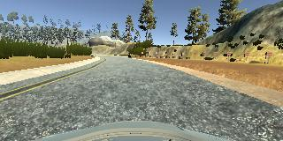

# **Behavioral Cloning** 

## Writeup Template

### You can use this file as a template for your writeup if you want to submit it as a markdown file, but feel free to use some other method and submit a pdf if you prefer.

---

**Behavioral Cloning Project**

The goals / steps of this project are the following:
* Use the simulator to collect data of good driving behavior
* Build, a convolution neural network in Keras that predicts steering angles from images
* Train and validate the model with a training and validation set
* Test that the model successfully drives around track one without leaving the road
* Summarize the results with a written report


[//]: # (Image References)

[image1]: ./examples/placeholder.png "Model Visualization"
[image2]: ./examples/placeholder.png "Grayscaling"
[image3]: ./examples/placeholder_small.png "Recovery Image"
[image4]: ./examples/placeholder_small.png "Recovery Image"
[image5]: ./examples/placeholder_small.png "Recovery Image"
[image6]: ./examples/placeholder_small.png "Normal Image"
[image7]: ./examples/placeholder_small.png "Flipped Image"

## Rubric Points
### Here I will consider the [rubric points](https://review.udacity.com/#!/rubrics/432/view) individually and describe how I addressed each point in my implementation.  

---
### Files Submitted & Code Quality

#### 1. Submission includes all required files and can be used to run the simulator in autonomous mode

My project includes the following files:
* model.py containing the script to create and train the model
* drive.py for driving the car in autonomous mode
* model.h5 containing a trained convolution neural network 
* writeup_report.md summarizing the results

#### 2. Submission includes functional code
Using the Udacity provided simulator and my drive.py file, the car can be driven autonomously around the track by executing 
```sh
python drive.py model.h5
```

#### 3. Submission code is usable and readable

The model.py file contains the code for training and saving the convolution neural network. The file shows the pipeline I used for training and validating the model, and it contains comments to explain how the code works.

### Model Architecture and Training Strategy

#### 1. An appropriate model architecture has been employed

My model consists of a convolution neural network of 9 layers, including a normalization layer, 5 convolutional layers
and 3 fully connected layers (model.py lines 92-122). The convolutional layers were designed to perform feature extraction. NVDIA network uses strided convolutions in the first three convolutional layers with a 2×2 stride and a 5×5 kernel and a non-strided convolution with a 3×3 kernel size in the last two convolutional layers. 

The model includes RELU layers to introduce nonlinearity (code line 94), and the data is normalized in the model using a Keras lambda layer (code line 92). The convolution layers follows 3 fully connected layer. Dropouts are introduced in the fully connected layer.

#### 2. Attempts to reduce overfitting in the model

The model was trained and validated on different data sets to ensure that the model was not overfitting. More data was collected for center lane driving, recovering from the left and right sides of the road and driving the reverse of the road. I also added dropout in the fully connected layer. The model was tested by running it through the simulator and ensuring that the vehicle could stay on the track.

#### 3. Model parameter tuning

The model used an adam optimizer, so the learning rate was not tuned manually (model.py line 125).

#### 4. Appropriate training data

Training data was chosen to keep the vehicle driving on the road. I used a combination of center lane driving, recovering from the left and right sides of the road and driving the reverse of the road


### Model Architecture and Training Strategy

#### 1. Solution Design Approach

The overall strategy for deriving a model architecture was to use the NVDIA end to end Learning for self-driving car

My first step was to use a convolution neural network model similar to the Lenet.  However i found the car was going off-trace. So i moved to NVIDIA model and that stopped the vehicle going off the track. 

I tried adding dropout layer of 50% and noticed the loss was not reducing as much. There was big gap between valdiation and training loss. However once i changed the dropout to about 10%, the gap between validation and training loss reduced. The car started driving more on the center of the road.

At the end of the process, the vehicle is able to drive autonomously around the track without leaving the road.

#### 2. Final Model Architecture

The final model architecture consisted of a convolution neural network with 9 layers, including a normalization layer, 5 convolutional layers and 3 fully connected layers (model.py lines 92-122).

Here is a visualization of the architecture (note: visualizing the architecture is optional according to the project rubric)


#### 3. Creation of the Training Set & Training Process

To capture good driving behavior, I first recorded two laps on track one using center lane driving. Here is an example image of center lane driving:



I then recorded the vehicle recovering from the left side and right sides of the road back to center so that the vehicle would learn to to recover when it goes to the side. These images show what a recovery looks.


To augment the data sat, I also flipped images and angles thinking that this would allow the model to not have a left-turn bias. For example, here is an image that has then been flipped:


After the collection process, I had 12855 number of data points. I then preprocessed this data by first cropping the top and bottom of the image to remove unnessary parts of the image followed by resizing the image to 64x64. 

I finally randomly shuffled the data set and put 20% of the data into a validation set. 

I used this training data for training the model. The validation set helped determine if the model was over or under fitting. The ideal number of epochs was 10 as evidenced by training and validation loss and accuracy. I used an adam optimizer so that manually training the learning rate wasn't necessary.
